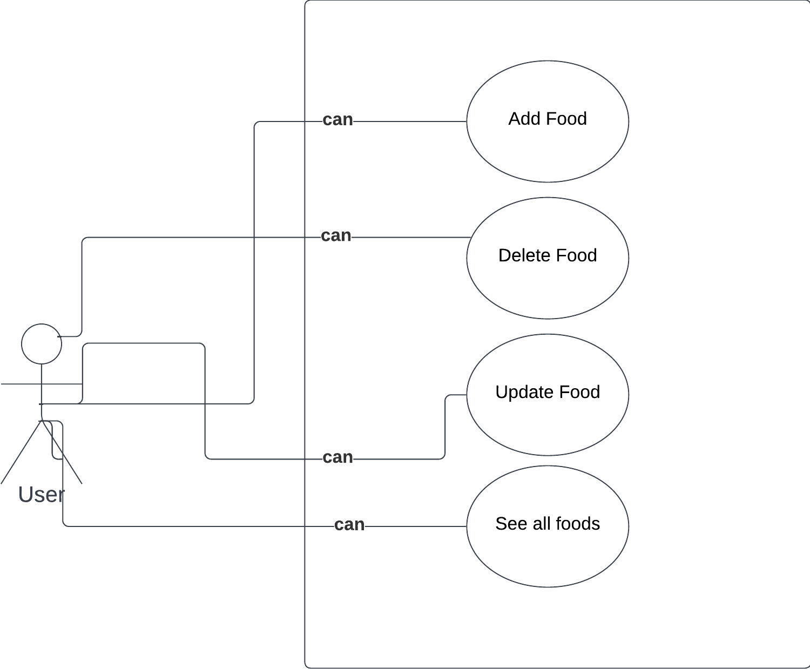
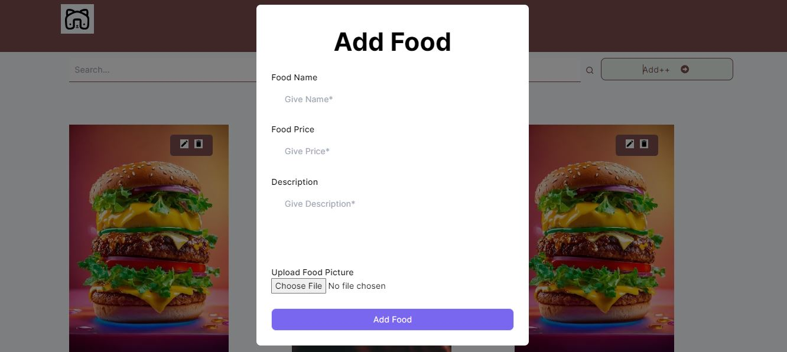
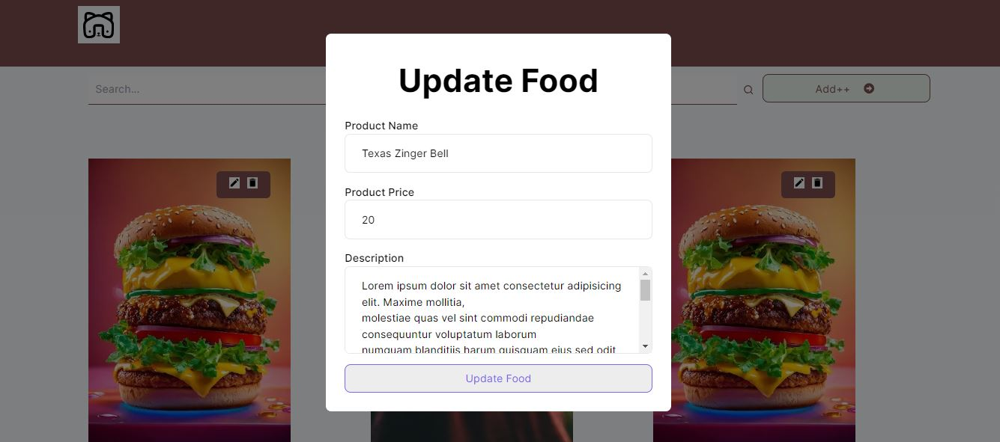
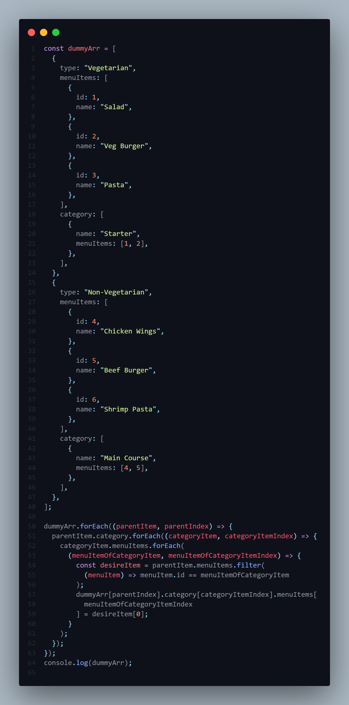

## Key Technologies

**Client-Side:** Next js, TailwindCSS

**Language:** TypeScript

**Test**: Jest

**Documentation**: Lucidchart

## Demo

- **Use Case Diagram**
  

- **Foods Page Read**
  

- **Add New Food**
  

- **Update Existing Food**
  

## Run Locally

Clone the project

```bash
  git clone https://github.com/SYShopnil/Remote-Kitchen-Task.git
```

Go to the project directory

```bash
  cd
  Remote-Kitchen-Task
```

Install dependencies

```bash
  npm install || npm i
```

Start the server

```bash
  npm run dev
```

Start the Test

```bash
  npm run test
```

## Task 2

**Question: 2. A project titled, “Alex’s Kitchen” from team "Remote Kitchen" uses Git for version control. Several developers are contributing, with each working on their own branch. The team follows certain conventions. Suppose you need to submit a hotfix. How would you name your branch? After finalizing your work in your designated branch, detail the steps you would take to create a PR and merge it with the production branch.**

```bash
I am description the process step by step.

Step 1 (Create branch): There will be a develop branch in the development phase. So I need to create a new branch as a reference from develop branch by do this command -> git branch <branch name> and then git checkout <branch name> but I have to stay in the develop branch that time.

Step 2 (Naming of branch): To give a naming of a branch I follow a convention like as I am working in a AGILE environment so each ticket has a identity. And also task can be two types like bug fix and new feature implementation. So if my task is implement new feature then I Use feature/alex-[ticket unique number]. If my task is to fix a bug or do some change on existing problem then I use refactor/alex-[ticket unique number]. For example I have to submit a hotfix. Suppose that, my jira ticket number is ALEX-105 where all description has been descripted and it is a fixing task. So I will name this branch to refactor/alex-105. And start my task there.

Step 3 (Committing): By commit some things I follow that with some bundle of related work commit together so that it would good for reviewer to read the code and give a genuine feedback.

Step 4 (Push and PR): After commit I have to push it into remote git repository by this command => git push refactor/alex-105. It will create a new branch in remote repository. Then I have to go to remote repository and create a PR or pull request where I have to give some details about the following task here I also follow a convention to write the task I have to start the details by using the desire branch name for example: refactor/alex-105(this will be linkable with main JIRA ticket) => Then I have give a brief description with point. And though my develop branch will be in a CI CD so I have to wait until the production build run. After successful comparison if no merge conflict detected then I have to make my code to review a member from my team.

Step 5 (Reviewing code and feedback): One of my team members will review my code and if somethings need to change then he/she will give me a feedback then again I have to do from step 3 and step 4. After successfully review he or she will merge the branch with develop branch. Where in the developing phase all code has stored.

Step 6 (Merge to master for production): After successfully complete all feature with no bug in develop branch then one of the tech lead will merge it to masters branch for a production build. And that’s how I use git to build a full application.

Thank You.

```

## Task 1

**Question: 1. A project titled, “Alex’s Kitchen” from team "Remote Kitchen" uses Git for version control. Several developers are contributing, with each working on their own branch. The team follows certain conventions. Suppose you need to submit a hotfix. How would you name your branch? After finalizing your work in your designated branch, detail the steps you would take to create a PR and merge it with the production branch.**

**Answer**

```bash
First I will iterate the dummyArray one time with Array.forEach() where I will get eachParentItem and indexOfParent.

Then I have to iterate eachParentItem.category by using forEach() inside the eachParentItem scope and will get categoryItem and categoryItemIndex .

Then again, I have iterate categoryItem.menuitems by using forEach() in the categoryItem scope. And In this scope I will get menuItemOfCategoryItem and it’s index name manuIteamCategoryIndex

Then, I have to filter the desire item from eachParentItem.menuItems and search by the manuIteamCategoryIndex.  Then just replace the desire menuItems into desire place where the reference kept accessing by using index.

In Summary in each element first I have to get desire menuItems part under Category  where the reference has kept. Then I just need to filter the respective menu Items from which is exist in the Parent scope and lastly just insert it to the menu items which is under category.
```

-**Code of Task 2**


## Support

**GitHub:** <div>
<a targe ="_blank" href="https://github.com/SYShopnil/" target="_blank"> SYShopnil GitHub </a></div>

**LinkedIn:** <div>
<a targe ="_blank" href="https://www.linkedin.com/in/sadmaney-yeasar/" target="\_blank"> sadmaney-yeasar </a></div>

**Email:** sadmanishopnil@gmail.com
